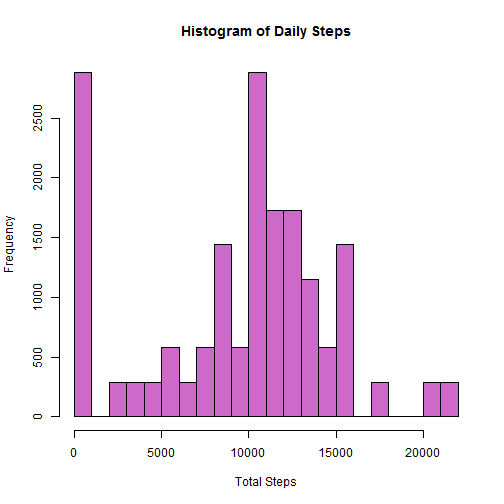
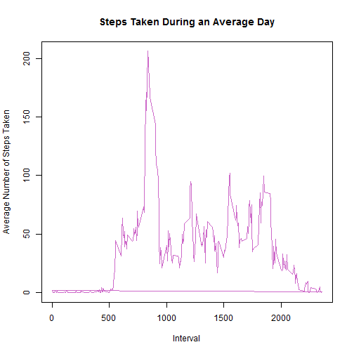
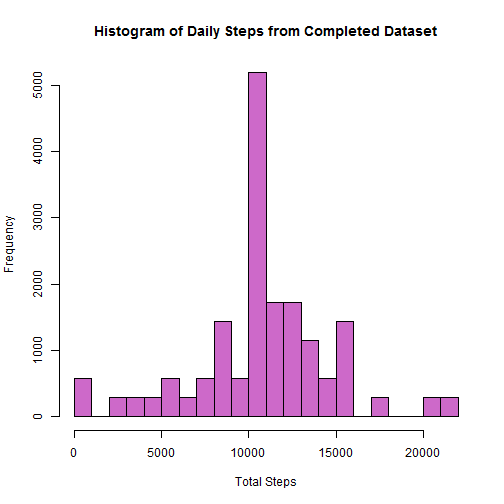
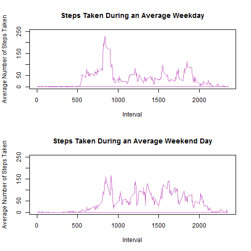

## Loading and preprocessing the data

```r
library(lubridate)
library(dplyr)
```


```r
if (!exists("activity")) {
    url <- "https://d396qusza40orc.cloudfront.net/repdata%2Fdata%2Factivity.zip"
    datafile <- "activity.zip"
    if (!file.exists("activity.csv")) {
        download.file(url, datafile, mode = "wb")
        unzip(datafile)
    }
    activity <- read.csv(gsub("zip", "csv", datafile))
    activity$date <- ymd(as.character(activity$date))
}
```


## What is mean total number of steps taken per day?

```r
daily_steps <- activity %>% 
               group_by(date) %>% 
    mutate(total = sum(steps, na.rm = TRUE))
hist(daily_steps$total, col = "orchid3", xlab = "Total Steps", 
     main = "Histogram of Daily Steps")
```

 

```r
mean(daily_steps$total)
```

```
## [1] 9354.23
```

```r
median(daily_steps$total)
```

```
## [1] 10395
```


## What is the average daily activity pattern?

```r
ave_daily_steps <- activity %>% 
                   group_by(interval) %>% 
                   mutate(average_day = mean(steps, na.rm = TRUE))
plot(ave_daily_steps$interval, ave_daily_steps$average_day, type = "l", 
     col = "orchid3", xlab = "Interval", ylab = "Average Number of Steps Taken", 
     main = "Steps Taken During an Average Day")
```

 

```r
maxsteps <- ave_daily_steps$interval[ave_daily_steps$average_day ==  
                                     max(ave_daily_steps$average_day)]
max(ave_daily_steps$average_day) # highest average of steps taken
```

```
## [1] 206.1698
```

```r
maxsteps[1] # interval which has the highest average of steps taken
```

```
## [1] 835
```


## Imputing missing values

```r
sum(!complete.cases(activity)) # number of intervals with NA value
```

```
## [1] 2304
```

I will fill in the missing values with the average number of steps for that interval over the observation period.


```r
comp_activity <- activity # copy original data before making changes
comp_activity$steps[is.na(comp_activity$steps)] <-  
    ave_daily_steps$average_day[is.na(comp_activity$steps)]
comp_daily_steps <- comp_activity %>% 
                    group_by(date) %>% 
                    mutate(total = sum(steps))
hist(comp_daily_steps$total, col = "orchid3", xlab = "Total Steps", 
     main = "Histogram of Daily Steps from Completed Dataset")
```

 

```r
mean(comp_daily_steps$total)
```

```
## [1] 10766.19
```

```r
median(comp_daily_steps$total)
```

```
## [1] 10766.19
```

```r
mean(comp_daily_steps$total) - mean(daily_steps$total)
```

```
## [1] 1411.959
```

```r
median(comp_daily_steps$total) - median(daily_steps$total)
```

```
## [1] 371.1887
```

Filling in the missing data had a large effect on the estimates of mean and median number of daily steps.  As expected, the median was affected less than the mean.


## Are there differences in activity patterns between weekdays and weekends?

```r
wk_activity <- comp_daily_steps
wk_activity$weekend <- factor(weekdays(wk_activity$date, abbreviate = FALSE) 
                              %in% c("Saturday", "Sunday"), 
                              labels = c("weekday", "weekend"))
par(mfrow = c(2, 1))
ave_wk_steps <- wk_activity %>% 
                group_by(interval, weekend) %>% 
                mutate(average_day = mean(steps))
plot(ave_wk_steps$interval[ave_wk_steps$weekend == "weekday"],  
     ave_wk_steps$average_day[ave_wk_steps$weekend == "weekday"], 
     type = "l", col = "orchid3", xlab = "Interval", ylim = c(0, 250),
     ylab = "Average Number of Steps Taken", 
     main = "Steps Taken During an Average Weekday")
plot(ave_wk_steps$interval[ave_wk_steps$weekend == "weekend"],  
     ave_wk_steps$average_day[ave_wk_steps$weekend == "weekend"], 
     type = "l", col = "orchid3", xlab = "Interval", ylim = c(0, 250),
     ylab = "Average Number of Steps Taken", 
     main = "Steps Taken During an Average Weekend Day")
```

 

Compared to the average weekday, weekend activity begins later and is more consistant through the day.
